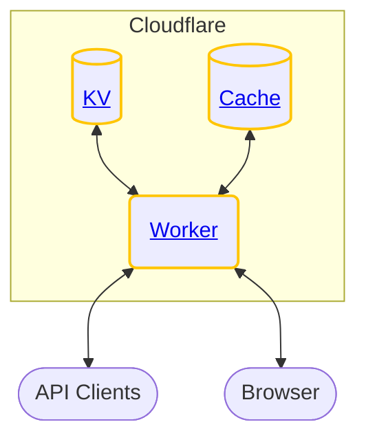

<h1 align="center"><strong>Atomic URL</strong></h1>



Designing a URL shortener such as [TinyURL](https://tinyurl.com/) and [Bitly](https://bitly.com/) is one of the most common System Design interview questions in software engineering.

While meddling around with Cloudflare Worker, it gave me an idea to build an actual URL shortener that can be used by anyone.

This is a proof of concept (POC) of how one builds an actual URL shortener service using serverless computing.

[Read more...](https://jerrynsh.com/i-built-my-own-tiny-url/)

## Table of Contents

- [Table of Contents](#table-of-contents)
- [Requirements](#requirements)
- [Setup](#setup)
  - [Installation](#installation)
  - [Creating KV](#creating-kv)
- [Optional: CI/CD](#optional-cicd)
- [Usage](#usage)
- [Deployment](#deployment)
- [Contributing](#contributing)
  - [Steps](#steps)

## Requirements

-   Get a [Cloudflare](https://www.cloudflare.com/) account
-   Install [Wrangler](https://developers.cloudflare.com/workers/wrangler/cli-wrangler/) CLI for Cloudflare Workers deployment

## Setup

Check out Steps 1 to 3 of this [Get Started Guide](https://developers.cloudflare.com/workers/get-started/guide/) to setup a Cloudflare account.

[Read more](https://developers.cloudflare.com/workers/wrangler/configuration/#configure-wranglertoml) about configuring `wrangler.toml`.

### Installation

This project is initialized using the [`itty-router`](https://github.com/kwhitley/itty-router) [worker template](https://github.com/cloudflare/worker-template-router).

```sh
npm ci
```

### Creating KV

Since we're using KV as our storage, we need to first create it.

```sh
wrangler kv:namespace create "URL_DB"
wrangler kv:namespace create "URL_DB" --preview
```

For creating these KV namespaces, remember to update your [`wrangler.toml`](./wrangler.toml) file to include the namespace bindings accordingly.

## Optional: CI/CD

1. This project uses [Wrangler actions](https://github.com/marketplace/actions/deploy-to-cloudflare-workers-with-wrangler) to automatically publish worker. To do so, add `CF_API_TOKEN` into your GitHub repository secrets. You can [create your API token](https://dash.cloudflare.com/profile/api-tokens) using the `Edit Cloudflare Workers` template.

2. This project also uses [semantic-release](https://github.com/semantic-release/npm) to automatically publish to NPM. To enable this, you will need to create a `NPM_TOKEN` via [npm create token](https://docs.npmjs.com/getting-started/working_with_tokens#how-to-create-new-tokens) and add it to your GitHub repository secrets.

## Usage

To try out the project locally, simply run `wrangler dev`.

## Deployment

> **NOTE**
> The deployment of this project is done using GitHub Actions CI/CD. For more details, check out [ci.yml](./.github/workflows/ci.yml) and [this article](https://jerrynsh.com/how-i-setup-ci-cd-pipeline-for-cloudflare-worker/).

1. Before publishing your code you need to edit [`wrangler.toml`](./wrangler.toml) file and add your Cloudflare `account_id` - more information about configuring and publishing your code can be found [in the documentation](https://developers.cloudflare.com/workers/learning/getting-started#7-configure-your-project-for-deployment).

2. [Create 2 KV](#creating-kv) and update your `wrangler.toml` file to include the namespace bindings accordingly.

3. To publish any new changes to your Cloudflare Worker, run `wrangler publish -e <env>` where `<env>` could `staging` or `production`.

## Contributing

Pull requests are welcome. For major changes, please open an issue first to discuss what you would like to change.

### Steps

1. Fork this
2. Create your feature branch (`git checkout -b jimmy/fooBar`)
3. Code
4. Commit your changes (`git commit -am 'feat: add some fooBar'`, make sure that your commits are [semantic](https://gist.github.com/joshbuchea/6f47e86d2510bce28f8e7f42ae84c716))
5. Push to the branch (`git push origin jimmy/fooBar`)
6. Create a new Pull Request
